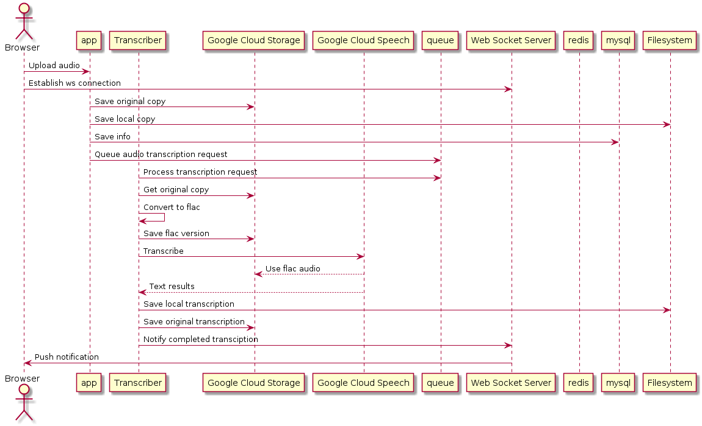

# Speech2Text 

A simple program to convert audio speech to text. 

### How to setup

On local:

1. Add `www.speech2text.com` to your `/etc/hosts`
2. Copy Google Cloud `key.json` into `var/data/key.json`
3. Bring up docker-compose network & setup

    ```bash
    # Bring up network
    docker-compose up -d
 
    # Move inside app container
    docker-compose exec app sh
    
    # Install dependencies
    composer install
    
    # Create database schema
    ./bin/console --no-interaction doctrine:migrations:migrate
 
    # Install 3rd party assets
    ./bin/console assets:install public
 
    ```

4. Visit `http://www.speech2text.com`.

### Sequence

